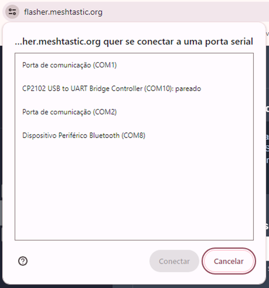
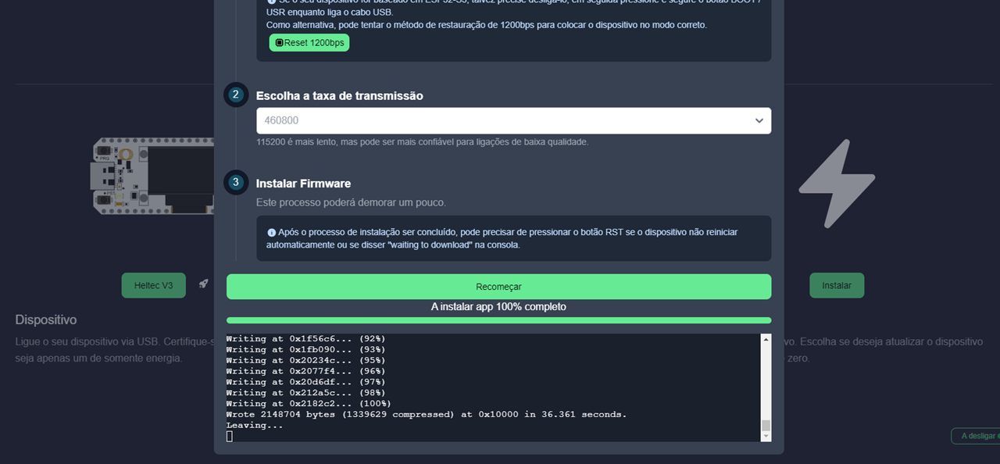

# 📡 Meshtastic Heltec V2 Firmware

Este repositório publica o firmware customizado para o dispositivo **Heltec V2** compatível com o projeto [Meshtastic](https://github.com/meshtastic/meshtastic-device) 🌐.

## 🚀 Sobre

Este projeto tem como objetivo facilitar a instalação e atualização do firmware Meshtastic em dispositivos Heltec V2, permitindo comunicação mesh via LoRa.

## 📦 Instalação

1. Baixe o [firmware](https://github.com/luciodias/heltec_v2/releases/latest) compilado.
1. Garanta que o [drivers](https://meshtastic.org/docs/getting-started/serial-drivers/esp32/) estão instalados no seu computador.
1. Acesse o site do [Web Flasher](https://flasher.meshtastic.org/) pelo Chrome.
1. Conecte seu Heltec V2 ao computador.
1. Na etapa **Dispositivo** selecione Heltec **V3**.
1. Na etapa **Firmware**, clique em&emsp;&emsp;e selecione o arquivo **.BIN** baixado.
1. Clique em **Instalar**&emsp;
1. Escolha a taxa de transmissão 460800.
1. Clique em **Atualizar** e selecione a porta **COM**  CP2102 USB to UART.
1. Aguarde a conclusão da Gravação.

## 📄 Licença

Este projeto está licenciado sob a [Licença Apache 2.0](LICENSE).

---

Feito com ❤️ para a comunidade Meshtastic!